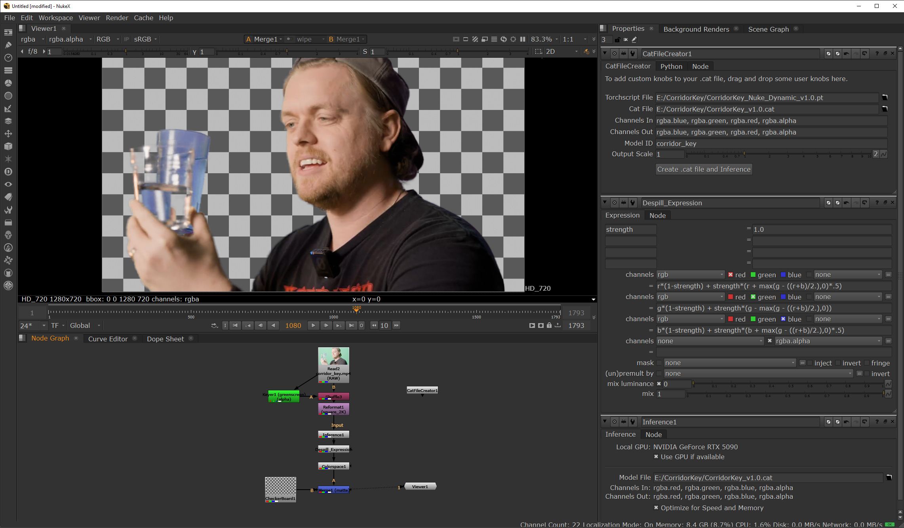

# CatFile Conversion for CorridorKey




Exportor for just the Greenformer model weights to TorchScript and convert that into a CAT file within Nuke!

## Steps

### 1. Installation

1. Clone the CorridorKey repo and download their model weights from HuggingFace
2. Create a virtual environment using compatible versions of Torch and Torchvision for the CATFile Creator, see [instructions on Nuke's .cat File Creation Reference](https://learn.foundry.com/nuke/developers/16.0/catfilecreationreferenceguide/introduction.html).

### 2. Conversions

1. Run the Python script `export_torchScript.py` from within your virtual environment, it'll create a file called `CorridorKey_Nuke_Dynamic_v1.0.pt`
2. Load Nuke and in a "CatFileCreator" node, enter the following lines into their respective fields:
   * Torchscript file:
   ```
   <path to>CorridorKey/CorridorKey_Nuke_Dynamic_v1.0.pt
   ```
   * Cat file:
   ```
   <path to>CorridorKey/CorridorKey_v1.0.cat
   ```
   * Channels In:
   ```
   rgba.blue, rgba.green, rgba.red, rgba.alpha
   ```
   * Channels Out:
   ```
   rgba.blue, rgba.green, rgba.red, rgba.alpha
   ```
   * Model ID:
   ```
   corridor_key
   ```

3. Once despilled you can return to linear color space with the appropriate node going from sRGB back to Linear.


### 2. Inference

1. Convert your MP4, PNG or JPG images to linear colorspace, or use the RAW checkbox on your read nodes.
2. Produce a rough core matte, roto nodes or even a simple keyer will do. You can also use other models from the [Nuke Cattery](https://community.foundry.com/cattery).
3. Note that the Inference node takes in 4 channels, so shuffle in your core alpha matte. And enable the "Optimize for speed and memory" checkbox to keep VRAM memory requirements below 24 GB.
4. The despill functionality is provided in a Nuke Expression node, with a variable strength set to 1 and the following equations per channel:
   * Red
   ```
   r*(1-strength) + strength*(r + max(g - ((r+b)/2.),0)*.5)
   ```
   * Green
   ```
   g*(1-strength) + strength*(g - max(g - ((r+b)/2.),0))
   ```
   * Blue
   ```
   b*(1-strength) + strength*(b + max(g - ((r+b)/2.),0)*.5)
   ```


## CorridorKey Licensing and Permissions

Use this tool for whatever you'd like, including for processing images as part of a commercial project! You MAY NOT repackage this tool and sell it, and any variations or improvements of this tool that are released must remain under the same license, and must include the name Corridor Key.

You MAY NOT offer inference with this model as a paid API service. If you run a commercial software package or inference service and wish to incoporate this tool into your software, shoot us an email to work out an agreement! I promise we're easy to work with. contact@corridordigital.com. Outside of the stipulations listed above, this license is effectively a variation of [Creative Commons Attribution-NonCommercial-ShareAlike 4.0 International License (CC BY-NC-SA 4.0)](https://creativecommons.org/licenses/by-nc-sa/4.0/)

Please keep the Corridor Key name in any future forks or releases!
